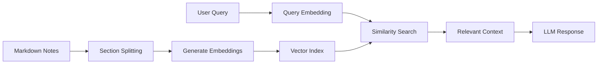

# 🧠 Note Assistant (Obsidian Plugin)


> Transform your Obsidian vault by adding an AI assistant context-aware through your notes.

## ✨ Features

- 🔍 **Semantic Search**: Automatically finds relevant notes using vector embeddings
- 💬 **Context-Aware Chat**: Conversational AI that understands your knowledge base
- 🏠 **100% Local**: Powered by Ollama - no data leaves your machine
- 📝 **Section-Based Embeddings**: Processes Markdown files by sections for precise context
- ⚙️ **Fully Customizable**: Custom system prompts and conversation settings
- 🧠 **Memory**: Maintains conversation history with configurable limits

## 🚀 Quick Start

### Prerequisites

- [Obsidian](https://obsidian.md/) installed
- [Ollama](https://ollama.ai) running locally or on another PC

### Installation

1. Download the latest release
2. Extract to `.obsidian/plugins/obsidian-note-assistant/`
3. Enable the plugin in Obsidian settings
4. Configure your Ollama endpoint and model

## 📖 Usage

Open the command palette (`Ctrl/Cmd + P`) and run **"Note Assistant: Open Note Assistant"** or click the brain icon in the sidebar.

### System Prompt Configuration

The power of this assistant lies in crafting specialized system prompts. Here are some examples:

#### 📚 Children's Book Writing Assistant
```
As a children's book writing specialist assistant, answer this question using:
- Context information provided from Obsidian
- Our conversation history to maintain consistency
- Recently consulted notes to ensure continuity

Make sure to:
- Respond in English
- Maintain consistency with the established universe and our previous exchanges
- Reference previously discussed elements when relevant
- Flag any potential contradictions
```

#### 🔬 Advanced Technology Research Assistant
```
As an assistant specialized in cutting-edge technology research, answer this question using:
- Context information provided from Obsidian
- Our conversation history to maintain consistency
- Recently consulted notes to ensure continuity

Make sure to:
- Respond in English
- Maintain consistency with the established universe and our previous exchanges
- Reference previously discussed elements when relevant
- Flag any potential contradictions
```

## 🏗️ How It Works



1. **Indexing**: Markdown files are split into logical sections
2. **Embedding**: Each section is converted to vectors using Ollama
3. **Search**: User queries are matched against the vector index
4. **Context**: Most relevant sections are included in the LLM prompt
5. **Response**: Ollama generates contextually aware responses

## 🙏 Acknowledgments

- [Obsidian](https://obsidian.md/) - Amazing knowledge management platform
- [Ollama](https://ollama.ai) - Making local AI accessible
- [Obsidian Plugin API](https://github.com/obsidianmd/obsidian-api) - Comprehensive plugin framework

## 📄 License

This project is licensed under the MIT License - see the [LICENSE](LICENSE) file for details.